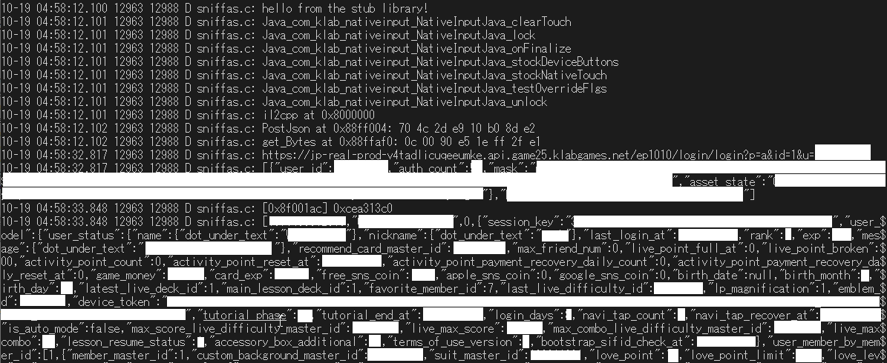

this is a collection of info about love live all stars' internals that I
collect and add as I reverse engineer it

this information is public domain. feel free to use it and republish it
however you please

I installed the game on android x86 on a PC (had to unroot android to make
it run) and fully updated it.

then i hooked up the android ssd to my linux machine, mounted it and
searched for any file that contained lovelive in the path and copied
everything

`split_config.armeabi_v7a.apk` contains the native binaries (lib folder)

`base.apk` contains assets and the java glue for unity

i used apktool 2.4.0 to extract the apk's

game uses unity. as of 2019-10-04, the version is 2018.4.2f1
(found in `base.apk/smali/com/unity3d/player/m.smali`)

```smali
    const-string v2, "Unity version     : %s\n"

    new-array v4, v3, [Ljava/lang/Object;

    const-string v5, "2018.4.2f1"
```

unity uses il2cpp to transpile C# assembly to C++ and compile it to a
native android shared library named il2cpp.so located in
`split_config.armeabi_v7a.apk/lib/arm`

interestingly, all stars only ships with arm binaries while the japanese
version of the old sif game had x86 binaries as well

using Il2CppDumper v4.6.0 it's possible to recover the method names and
strings by giving it the il2cpp.so first and then the global-metadata.dat
located in `base.apk/assets/bin/Data/Managed/Metadata` . it should do it
automatically, remember to specify 2018.4 as the unity version.

Il2CppDumper generates a script.py for IDA. but since i use ghidra instead
of IDA's proprietary garbage, I used this script by worawit:
https://gist.github.com/Francesco149/289a24d2f17ba60f820f801b8bd6754a
for ghidra which takes the IDA script as input and renames everything

I now have a mostly named disassembly and we have also recovered all the
string constants so reversing stuff should be much easier this way

after skimming through the strings (they all have the `StringLiteral_`
prefix), i found three interesting strings referenced by
`ServerConfig$$.cctor`

```
https://jp-real-prod-v4tadlicuqeeumke.api.game25.klabgames.net/ep1002
i0qzc6XbhFfAxjN2
x\'B73DA9C0EE7116836995B5ACED4AA33B095ECAF77B33605833FD759E6E743F1D\'
```

note: these values change with every update, they already changed as I
wrote these notes, but they're pretty easy to find anyway.

which I speculatively named ServerHost, ServerPassword and ServerKey

the disassembly of that ServerConfig ctor reveals that they're using a
library named DotUnder

```c
void ServerConfig$$.cctor(void)

{
  int iVar1;
  int *piVar2;
  undefined4 uVar3;

  if (DAT_037021b1 == '\0') {
                    /* WARNING: Subroutine does not return */
    FUN_008722e4(0x8c63);
  }
  **(undefined4 **)(Class$DotUnder.ServerConfig + 0x5c) = ServerHost;
  piVar2 = (int *)Encoding$$get_UTF8(0);
  if (piVar2 == (int *)0x0) {
    FUN_0089db60(0);
  }
  uVar3 = (**(code **)(*piVar2 + 0x148))(piVar2,ServerPassword,*(undefined4 *)(*piVar2 + 0x14c));
  iVar1 = Class$DotUnder.ServerConfig;
  *(undefined4 *)(*(int *)(Class$DotUnder.ServerConfig + 0x5c) + 4) = uVar3;
  *(undefined4 *)(*(int *)(iVar1 + 0x5c) + 8) = ServerKey;
  *(undefined4 *)(*(int *)(iVar1 + 0x5c) + 0xc) = StringLiteral_7288;
  *(undefined *)(*(int *)(iVar1 + 0x5c) + 0x10) = 0;
  return;
}
```

however, googling DotUnder doesn't seem to yield any results so it's
probably an internal library

we can use getter names to figure out what the fields of the ServerConfig
struct are though, for example:

```c
undefined4 Config$$get_StartupKey(void)

{
  if (DAT_03704350 == '\0') {
                    /* WARNING: Subroutine does not return */
    FUN_008722e4(0x26ce);
  }
  if (((*(byte *)(Class$DotUnder.ServerConfig + 0xbf) & 2) != 0) &&
     (*(int *)(Class$DotUnder.ServerConfig + 0x70) == 0)) {
    FUN_0087fd40();
  }
  return *(undefined4 *)(*(int *)(Class$DotUnder.ServerConfig + 0x5c) + 4);
}
```

this tells us that what we named ServerPassword is originally named
StartupKey. why? because it's returning offset 4 of ServerConfig + 0x5c,
which is the same that is assigned in the ctor

```c
  uVar3 = (**(code **)(*piVar2 + 0x148))(piVar2,ServerPassword,*(undefined4 *)(*piVar2 + 0x14c));
  iVar1 = Class$DotUnder.ServerConfig;
  *(undefined4 *)(*(int *)(Class$DotUnder.ServerConfig + 0x5c) + 4) = uVar3;
```

by browsing all references to ServerConfig I renamed ServerHost to
ServerEndpoint and ServerPassword to StartupKey.

I couldn't find any reference to the ServerKey offset, so for now I'm
leaving it.

using ghidra's data type manager and checking all the getter names as
before I map out the ServerConfig struct. this makes the decompile output
a whole lot more readable.

I also figured out that each object has the same wrapper struct where you
have a pointer to the actual data at 0x5c. I saw other object being checked
at the same offsets

```c
void ServerConfig$$.cctor(void)

{
  Object *config;
  int *utf8;
  char *utf8StartupKey;

  if (DAT_037021b1 == '\0') {
                    /* WARNING: Subroutine does not return */
    FUN_008722e4(0x8c63);
  }
  Class$DotUnder.ServerConfig->Instance->ServerEndpoint = ServerEndpoint;
  utf8 = (int *)Encoding$$get_UTF8(0);
  if (utf8 == (int *)0x0) {
    FUN_0089db60(0);
  }
  utf8StartupKey =
       (char *)(**(code **)(*utf8 + 0x148))(utf8,StartupKey,*(undefined4 *)(*utf8 + 0x14c));
  config = Class$DotUnder.ServerConfig;
  Class$DotUnder.ServerConfig->Instance->StartupKey = utf8StartupKey;
  config->Instance->ServerKey = ServerKey;
  config->Instance->BuildId = BuildId;
  config->Instance->Unk1 = false;
  return;
}
```

after digging around some more I found this class named DMHttpApi which has
a method named CalcDigest called in MakeRequestData which does a
hmac sha-1 hash with the given params. so far it all seems very similar to
how the original sif request signing worked

upon further inspection, MakeRequestData takes 2 strings and concatenates
them with a space in between, then does a hmac-sha1 using some key stored
in DMHttpApi

```c
Array * DMHttpApi$$CalcDigest(Array *param_1,Array *param_2,int param_2_index,int param_2_len)

{
  System.Text.Encoding *enc;
  Array *param_1_bytes;
  Array *param_4_1;
  undefined4 uVar1;
  Array *key;
  uint param_1_len;
  
  if (DAT_037033d9 == '\0') {
                    /* WARNING: Subroutine does not return */
    FUN_008722e4(0x2bcc);
  }
  enc = Encoding$$get_UTF8((System.Text.Encoding *)0x0);
  if (enc == (System.Text.Encoding *)0x0) {
    ThrowException(0);
  }
  param_1_bytes = (Array *)(*enc->vtable->DoSomething)(enc,param_1,enc->vtable->SomePredicateFunc);
  if (param_1_bytes == (Array *)0x0) {
    ThrowException(0);
  }
  param_4_1 = (Array *)Instantiate(Class$byte[],param_2_len + param_1_bytes->Length + 1);
  if (param_1_bytes == (Array *)0x0) {
    ThrowException(0);
    Array$$Copy(0,0,param_4_1,0,_DAT_0000000c);
    ThrowException(0);
  }
  else {
                    /* param_4_1 = param_1_bytes
                       
                       Array.Copy(src, srcIndex, dst, dstIndex, len) */
    Array$$Copy(param_1_bytes,0,param_4_1,0,param_1_bytes->Length);
  }
  if (param_4_1 == (Array *)0x0) {
    ThrowException(0);
  }
  param_1_len = param_1_bytes->Length;
  if ((uint)param_4_1->Length <= param_1_len) {
    uVar1 = FUN_0089ec04();
    ThrowSomeOtherException(uVar1,0,0);
  }
                    /* append a space to param_4_1 */
  (&param_4_1->Data)[param_1_len] = ' ';
                    /* append param_2[param_2_index,param_2_len] to param_4_1 */
  Array$$Copy(param_2,param_2_index,param_4_1,param_1_bytes->Length + 1,param_2_len);
  if (((Class$DotUnder.DMHttpApi->BitField1 & 2) != 0) && (Class$DotUnder.DMHttpApi->Unk1 == 0)) {
    FUN_0087fd40();
  }
  key = Class$DotUnder.DMHttpApi->Instance->HmacSha1Key;
  if (((Class$DotUnder.DMCryptography->BitField1 & 2) != 0) &&
     (Class$DotUnder.DMCryptography->Unk1 == 0)) {
    FUN_0087fd40();
  }
  DMCryptography$$HmacSha1(param_4_1,key);
  param_4_1 = (Array *)Lib$$Hexlify();
  return param_4_1;
}
```

a quick search for references to HmacSha1Key in DMHttpApi tells us that
it's internally called SessionKey

```c
undefined4 DMHttpApi$$CopySessionKey(undefined4 param_1)

{
  undefined4 uVar1;
  
  if (DAT_037033d8 == '\0') {
                    /* WARNING: Subroutine does not return */
    FUN_008722e4(0x2bcf);
  }
  uVar1 = Instantiate(Class$byte[],param_1);
  if (((Class$DotUnder.DMHttpApi->BitField1 & 2) != 0) && (Class$DotUnder.DMHttpApi->Unk1 == 0)) {
    FUN_0087fd40();
  }
  Array$$Copy(Class$DotUnder.DMHttpApi->Instance->HmacSha1Key,uVar1,param_1,0);
  return uVar1;
}
```

looking for references to the SessionKey field I found this, which looks
very similar to the old SIF request signing

```c
void DMHttpApi.__c__DisplayClass14_1$$_Login_b__1(int param_1,int param_2)

{
  undefined4 uVar1;
  Array *pAVar2;
  int iVar3;
  undefined4 uVar4;
  undefined8 uVar5;
  
  if (DAT_037033e2 == '\0') {
                    /* WARNING: Subroutine does not return */
    FUN_008722e4(0xb482);
  }
  uVar4 = *(undefined4 *)(param_1 + 8);
  if (param_2 == 0) {
    ThrowException(0);
  }
  uVar1 = LoginResponse$$get_SessionKey(param_2,0);
  if (((*(byte *)(Class$System.Convert + 0xbf) & 2) != 0) &&
     (*(int *)(Class$System.Convert + 0x70) == 0)) {
    FUN_0087fd40();
  }
  uVar1 = Convert$$FromBase64String(uVar1,0);
  pAVar2 = (Array *)Lib$$XorBytes(uVar4,uVar1);
  if (((Class$DotUnder.DMHttpApi->BitField1 & 2) != 0) && (Class$DotUnder.DMHttpApi->Unk1 == 0)) {
    FUN_0087fd40();
  }
  Class$DotUnder.DMHttpApi->Instance->SessionKey = pAVar2;
  if (param_2 == 0) {
    ThrowException(0);
  }
  uVar5 = LoginResponse$$get_LastTimestamp(param_2,0);
  Clock$$SetLastTimestamp((int)((ulonglong)uVar5 >> 0x20),(int)uVar5,0);
  iVar3 = *(int *)(param_1 + 0x14);
  if (iVar3 == 0) {
    ThrowException(0);
  }
  iVar3 = *(int *)(iVar3 + 8);
  if (iVar3 == 0) {
    ThrowException(0);
  }
  FUN_023a2ee8(iVar3,param_2,Method$Action_LoginResponse_.Invoke());
  return;
}
```

so essentially what's happening is some http request response contains a
base64 key which is then decoded and xored with a xor key string. the
result is used as the session key

this appears to be the xor key:

```c
  uVar4 = *(undefined4 *)(param_1 + 8);

  ...

  pAVar2 = (Array *)Lib$$XorBytes(uVar4,uVar1);
```

param_1 appears to be some class instance, let's map the struct with just
the xor key field for now

as for param_2, we can deduce that it's a LoginResponse instance since it's
passed as the this pointer for `LoginResponse$$get_SessionKey`

let's map some of LoginResponse's field by looking at its getters

```c
undefined4 LoginResponse$$get_UserModel(int param_1)

{
  return *(undefined4 *)(param_1 + 0xc);
}

undefined4 LoginResponse$$get_SessionKey(int param_1)

{
  return *(undefined4 *)(param_1 + 8);
}

uint LoginResponse$$get_IsPlatformServiceLinked(int param_1)

{
  return (uint)*(byte *)(param_1 + 0x10);
}

undefined8 LoginResponse$$get_LastTimestamp(int param_1)

{
  return CONCAT44(*(undefined4 *)(param_1 + 0x18),*(undefined4 *)(param_1 + 0x1c));
}

undefined4 LoginResponse$$get_Cautions(int param_1)

{
  return *(undefined4 *)(param_1 + 0x20);
}

uint LoginResponse$$get_ShowHomeCaution(int param_1)

{
  return (uint)*(byte *)(param_1 + 0x24);
}

undefined4 LoginResponse$$get_LiveResume(int param_1)

{
  return *(undefined4 *)(param_1 + 0x28);
}
```

by looking at `DMHttpApi$$Logout` we can map a few unknown fields for
DMHttpApi as well as the connection field

```c
void DMHttpApi$$Logout(void)

{
  DMHttpApiObject *pDVar1;
  DMHttpApi *pDVar2;
  int iVar3;

  if (DAT_037033d6 == '\0') {
                    /* WARNING: Subroutine does not return */
    FUN_008722e4(0x2bd3);
  }
  if (((Class$DotUnder.DMHttpApi->BitField1 & 2) != 0) && (Class$DotUnder.DMHttpApi->Unk1 == 0)) {
    FUN_0087fd40();
  }
  iVar3 = *(int *)&Class$DotUnder.DMHttpApi->Instance->field_0xc;
  if (iVar3 != 0) {
    if (((Class$DotUnder.DMHttpApi->BitField1 & 2) != 0) && (Class$DotUnder.DMHttpApi->Unk1 == 0)) {
      FUN_0087fd40();
      iVar3 = *(int *)&Class$DotUnder.DMHttpApi->Instance->field_0xc;
      if (iVar3 == 0) {
        iVar3 = 0;
        ThrowException(0);
      }
    }
    Network.Connection$$Cancel(iVar3,0);
    if (((*(byte *)(_Class$DotUnder.HttpSubject + 0xbf) & 2) != 0) &&
       (*(int *)(_Class$DotUnder.HttpSubject + 0x70) == 0)) {
      FUN_0087fd40();
    }
    HttpSubject$$OnCancel();
  }
  if (((Class$DotUnder.DMHttpApi->BitField1 & 2) != 0) && (Class$DotUnder.DMHttpApi->Unk1 == 0)) {
    FUN_0087fd40();
  }
  pDVar2 = Class$DotUnder.DMHttpApi->Instance;
  *(undefined4 *)&pDVar2->field_0x4 = 0;
  *(undefined4 *)pDVar2 = 0;
  pDVar1 = Class$DotUnder.DMHttpApi;
  Class$DotUnder.DMHttpApi->Instance->SessionKey = (Array *)0x0;
  *(undefined4 *)&pDVar1->Instance->field_0xc = 0;
  *(undefined4 *)&pDVar1->Instance[1].field_0x1 = 0;
  *(undefined4 *)&pDVar1->Instance[1].field_0x5 = 0;
  return;
}
```

by looking at DmHttpApi's getters i was able to name the field IsGuarded

at this point i just start looking at every DmHttpApi method, this seems
to be a simple counter, and tells me that that Unk3 field is the request id

```c
void DMHttpApi$$CreateRequestId(void)

{
  DMHttpApiObject *pDVar1;
  
  if (DAT_037033da == '\0') {
                    /* WARNING: Subroutine does not return */
    FUN_008722e4(0x2bd0);
  }
  if (((Class$DotUnder.DMHttpApi->BitField1 & 2) != 0) && (Class$DotUnder.DMHttpApi->Unk1 == 0)) {
    FUN_0087fd40();
  }
  pDVar1 = Class$DotUnder.DMHttpApi;
  Class$DotUnder.DMHttpApi->Instance->Unk3 = Class$DotUnder.DMHttpApi->Instance->Unk3 + 1;
  FUN_01746d54(&pDVar1->Instance->Unk3,0);
  return;
}
```

that function call at the end appears to stringify it, so I assume this
returns a string

in `DMHttpApi.__c__DisplayClass14_1$$_Login_b__2` i found a reference to
some UserKey class, we'll take a look at that later

more familiar base64 xoring in this login step, also it references
StartupResponse which I should probably start mapping

```c

void DMHttpApi.__c__DisplayClass14_2$$_Login_b__4(int param_1,int param_2)

{
  undefined4 uVar1;
  Array *string;
  int iVar2;
  Array *pAVar3;

  if (DAT_037033e5 == '\0') {
                    /* WARNING: Subroutine does not return */
    FUN_008722e4(0xb486);
  }
  if (param_2 == 0) {
    ThrowException(0);
    uVar1 = StartupResponse$$get_UserId(0,0);
    pAVar3 = *(Array **)(param_1 + 8);
    ThrowException(0);
  }
  else {
    uVar1 = StartupResponse$$get_UserId(param_2,0);
    pAVar3 = *(Array **)(param_1 + 8);
  }
  string = (Array *)StartupResponse$$get_AuthorizationKey(param_2,0);
  if (((*(byte *)(Class$System.Convert + 0xbf) & 2) != 0) &&
     (*(int *)(Class$System.Convert + 0x70) == 0)) {
    FUN_0087fd40();
  }
  string = Convert$$FromBase64String(string);
  pAVar3 = Lib$$XorBytes(pAVar3,string);
  UserKey$$SetIDPW(uVar1,pAVar3,0);
  iVar2 = *(int *)(param_1 + 0xc);
  if (iVar2 == 0) {
    ThrowException(0);
  }
  iVar2 = *(int *)(iVar2 + 0x10);
  if (iVar2 == 0) {
    ThrowException(0);
  }
  FUN_023b38fc(iVar2,uVar1,pAVar3,Method$Action_int_-byte[]_.Invoke());
  return;
}
```

I mapped Connection and StartupResponse fields based on the getters as
usual. probably unnecessary

at this point I start looking through strings again and I find strings that
are most likely api endpoints, most of them referenced by various methods

```
/login/startup
/live/surrender
/navi/tapLovePoint
/terms/agreement
/tutorial/phaseEnd
```

and so on

let's take a look at what references `/login/startup`

```c
undefined4 Startup$$get_Path(void)

{
  if (DAT_036ffcc5 == '\0') {
                    /* WARNING: Subroutine does not return */
    FUN_008722e4(0x92cd);
  }
  return login_startup;
}
```

while looking through the Startup methods I notice that ghidra is actually
failing to disassemble a lot of the code because it thinks some functions
aren't returning. I should've disabled non-returning function discovery on
the analysis settings. I'm going to re-run the analysis. this kind of thing
should also be fixable by doing `func.setNoReturn(False)`

re-analyzing didn't fix, had to manually right click the flow override
comments and set flow to default

finally `StartupRequestBuilder$$Create` disassembles properly as well as
many other similar functions that used to only be a Instantiate1 call

```c
void StartupRequestBuilder$$Create(undefined4 param_1,int param_2)

{
  undefined4 uVar1;
  undefined4 uVar2;
  
  if (DAT_037021c9 == '\0') {
                    /* WARNING: Subroutine does not return */
    FUN_008722e4(0x92cb);
  }
  uVar1 = Clock$$get_TimeDifference(0);
  uVar2 = Instantiate1(Class$DotUnder.Structure.StartupRequest);
  StartupRequest$$.ctor(uVar2,param_1,StringLiteral_73,uVar1,0);
  if (param_2 == 0) {
    ThrowException(0);
  }
  FUN_023a2ee8(param_2,uVar2,Method$Action_StartupRequest_.Invoke());
  return;
}
```

I'm not sure how to automatically fixup this thing globally so for now I'm
manually fixing the flow where needed

this also fixed the disassembly for the Serialization functions which
now tell us exactly what fields the request should have

```c
int Serialization$$SerializeStartupRequest(int *param_1)

{
  /* ... */

  iVar3 = StartupRequest$$get_Mask(param_1,0);
  if (iVar3 != 0) {
    if (bVar1) {
      ThrowException(0);
    }
    uVar4 = StartupRequest$$get_Mask(param_1,0);
    if (iVar2 == 0) {
      ThrowException(0);
    }
    FUN_023742d0(iVar2,mask,uVar4,Method$Dictionary_string_-object_.set_Item());
  }
  if (bVar1) {
    ThrowException(0);
  }
  iVar3 = StartupRequest$$get_ResemaraDetectionIdentifier(param_1,0);
  if (iVar3 != 0) {
    if (bVar1) {
      ThrowException(0);
    }
    uVar4 = StartupRequest$$get_ResemaraDetectionIdentifier(param_1,0);
    if (iVar2 == 0) {
      ThrowException(0);
    }
    FUN_023742d0(iVar2,resemara_detection_identifier,uVar4,
                 Method$Dictionary_string_-object_.set_Item());
  }
  if (bVar1) {
    ThrowException(0);
  }
  uStack32 = StartupRequest$$get_TimeDifference(param_1,0);
  uVar4 = FUN_008ae744(Class$int,&uStack32);
  if (iVar2 == 0) {
    ThrowException(0);
  }
  FUN_023742d0(iVar2,time_difference,uVar4,Method$Dictionary_string_-object_.set_Item());
  return iVar2;
}
```

the `FUN_023742d0` calls set request fields and the second argument is the
field name

this "resemara detection" is intriguing. after searching for resemara
in the symbols table i found `AndroidPlatform$$LoadResemaraDetectionIdentifier`

halfway into this function it passes the string "getResemaraDetectionId"
to a function:

```c
  uVar5 = FUN_0149a010(piVar1,getResemaraDetectionId,piVar3,
                       Method$AndroidJavaObject.CallStatic()_AndroidJavaObject_);
```

this is very familiar, it's calling into java code, and I imagine piVar1
is a java context object of some sort.

time to decompile the java side

for some reason dragging ```base.apk``` into my current ghidra project
wasn't working (it wouldn't show classes.dex to decompile) so I created a
new project and imported ```base.apk``` which correctly decompiled

you will notice that there's strings defined with a scrambled version of
each function name. this was also present in old SIF, I think it's just
something that java does:

```
                             **************************************************************
                             * 4ebf                                                       *
                             *                                                            *
                             * createResemaraDetectionId                                  *
                             **************************************************************
                             strings::createResemaraDetectionId              XREF[1]:     00013b6c(*)  
        003a3fa2 19 63 72        string_d
                 65 61 74 
                 65 52 65 
           003a3fa2 19              db[1]                             utf16_size                        XREF[1]:     00013b6c(*)  
              003a3fa2 [0]            19h
           003a3fa3 63 72 65 61 74  utf8      u8"cetRsmrDtcind"       data
                    65 52 65 73 65 
                    6d 61 72 61 44

```

it could be useful to look for calls to those particular functions in the
native binary when they are obfuscated with this system.

but let's get to the juicy bits, let's search for resemara in the symbols
table and follow the code

```java
void ResemaraDetectionIdentifierRequest(ResemaraDetectionIdentifierRequest this,Listener p1)
{
  this.<init>();
  this.mListener = p1;
  return;
}

ResemaraDetectionIdentifierRequest getResemaraDetectionId(Listener p0)
{
  ResemaraDetectionIdentifierRequest local_0;
  
  local_0 = new ResemaraDetectionIdentifierRequest(p0);
  local_0.createResemaraDetectionId();
  return local_0;
}

void createResemaraDetectionId(ResemaraDetectionIdentifierRequest this)
{
  Thread local_0;
  Runnable ref;

  ref = new Runnable(this);
  local_0 = new Thread(ref);
  local_0.start();
  return;
}

void run(ResemaraDetectionIdentifierRequest$1 this)
{
  Context ref;
  AdvertisingIdClient$Info ref_00;
  String pSVar1;
  String pSVar2;
  Activity local_0;
  ResemaraDetectionIdentifierRequest pRVar3;
  StringBuilder ref_01;

  local_0 = UnityPlayer.currentActivity;
  ref = local_0.getApplicationContext();
  ref_00 = AdvertisingIdClient.getAdvertisingIdInfo(ref);
  pSVar1 = ref_00.getId();
  local_0 = UnityPlayer.currentActivity;
  ref = local_0.getApplicationContext();
  pSVar2 = ref.getPackageName();
  pRVar3 = this.this$0;
  ref_01 = new StringBuilder();
  ref_01.append(pSVar1);
  ref_01.append(pSVar2);
  pSVar1 = ref_01.toString();
  pSVar1 = ResemaraDetectionIdentifierRequest.access$000(pRVar3,pSVar1);
  if (pSVar1 == "") {
    ResemaraDetectionIdentifierRequest.access$100
              (this.this$0,"",ResemaraDetectionIdResultKind.Failed);
  }
  else {
    ResemaraDetectionIdentifierRequest.access$100
              (this.this$0,pSVar1,ResemaraDetectionIdResultKind.Succeeded);
  }
  return;
}

String access$000(ResemaraDetectionIdentifierRequest p0,String p1)
{
  String pSVar1;

  pSVar1 = p0.md5(p1);
  return pSVar1;
}

void access$100(ResemaraDetectionIdentifierRequest p0,String p1,ResemaraDetectionIdResultKind p2)

{
  p0.sendMessage(p1,p2);
  return;
}

void sendMessage(ResemaraDetectionIdentifierRequest this,String p1,ResemaraDetectionIdResultKind p2)
{
  int iVar1;
  Listener ref;

  if (this.mListener != null) {
    ref = this.mListener;
    iVar1 = p2.getKindInt();
    ref.onReceived(p1,iVar1);
  }
  return;
}

String md5(ResemaraDetectionIdentifierRequest this,String p1)
{
  MessageDigest ref;
  byte[] pbVar1;
  String ref_00;
  int iVar2;
  BigInteger ref_01;
  StringBuilder ref_02;

  ref = MessageDigest.getInstance("MD5");
  ref.reset();
  pbVar1 = p1.getBytes("UTF-8");
  ref.update(pbVar1);
  pbVar1 = ref.digest();
  ref_01 = new BigInteger(1,pbVar1);
  ref_00 = ref_01.toString(0x10);
  while (iVar2 = ref_00.length(), iVar2 < 0x20) {
    ref_02 = new StringBuilder();
    ref_02.append("0");
    ref_02.append(ref_00);
    ref_00 = ref_02.toString();
  }
  return ref_00;
}
```

okay, so it's just cramming a bunch of info into a string which is then
turned into a md5 hash and right-padded with zeros to 0x20 characters.
shouldn't be too hard to emulate if needed

back to the native code. I keep searching for startup in the symbols table
and eventually notice a class named ```DotUnder.SVAPI.Startup```. looking
for references to this brings me to this function

```c
void DMHttpApi.__c__DisplayClass14_2$$_Login_b__3(int param_1,undefined4 param_2)

{
  int svapi;
  int response;
  
  if (DAT_037033e4 == '\0') {
    FUN_008722e4(0xb485);
    DAT_037033e4 = '\x01';
  }
  svapi = Instantiate1(Class$DotUnder.SVAPI.Startup);
  Startup$$.ctor(svapi,0);
  response = *(int *)(param_1 + 0x10);
  if (response == 0) {
    response = Instantiate1(Class$Action_StartupResponse_);
    FUN_023a2ed4(response,param_1,Method$DMHttpApi.__c__DisplayClass14_2._Login_b__4(),
                 Method$Action_StartupResponse_..ctor());
    *(int *)(param_1 + 0x10) = response;
  }
  if (svapi == 0) {
    ThrowException(0);
  }
  RuleNoAuth$$Send(svapi,param_2,response,Method$RuleNoAuth_StartupRequest_-StartupResponse_.Send())
  ;
  return;
}
```

it seems that this SVAPI class is responsible for constructing the API
calls. let's search for it

tracking down the methods is tricky, it seems that all the methods
are called indirectly, maybe virtual methods?

```c
void RuleNoAuth$$Send(int svapi,undefined4 param_2,undefined4 param_3,int method)

{
  code **ppcVar1;
  
  if (svapi == 0) {
    ThrowException(0);
  }
  ppcVar1 = (code **)**(code ***)(*(int *)(method + 0xc) + 0x60);
  (**ppcVar1)(svapi,param_2,param_3,1,1,ppcVar1);
  return;
}
```

dead end for now, we will maybe come back to this later, let's scroll
around some more in the DisplayClass14 methods which all seem to relate to
the login/auth process

the PublicEncrypt method is a simple call to the standard c# encryption lib

```
void DMCryptography$$PublicEncrypt(undefined4 param_1)

{
  int provider;

  if (DAT_037033cb == '\0') {
    FUN_008722e4(0x2bc6);
    DAT_037033cb = '\x01';
  }
  if (((Class$DotUnder.DMCryptography->BitField1 & 2) != 0) &&
     (Class$DotUnder.DMCryptography->Unk1 == 0)) {
    FUN_0087fd40();
  }
  provider = *(int *)&Class$DotUnder.DMCryptography->Instance->field_0x4;
  if (provider == 0) {
    ThrowException(0);
  }
  RSACryptoServiceProvider$$Encrypt(provider,param_1,1,0);
  return;
}
```

this is also familiar, old SIF used public key encryption and a random
string of bytes too

if we look at the msdn documentation we find that the overloads for Encrypt
are:

* `Encrypt(Byte[], Boolean)` Encrypts data with the RSA algorithm.
* `Encrypt(Byte[], RSAEncryptionPadding)` Encrypts data with the RSA
  algorithm using the specified padding.

in our case, it's using the first overload and the last zero parameter is
either incorrect decompilation or additional stuff generated by il2cpp

this function also tells us that offset 0x4 of DMCryptography is the
RSACryptoServiceProvider instance

key size is 1024:

```c
int * DMCryptography$$CreateRSAProvider(void)

{
  int *provider;

  if (DAT_037033d0 == '\0') {
    FUN_008722e4(0x2bc4);
    DAT_037033d0 = '\x01';
  }
  provider = (int *)Instantiate1(Class$System.Security.Cryptography.RSACryptoServiceProvider);
  RSACryptoServiceProvider$$.ctor(provider,0x400,0);
  if (provider == (int *)0x0) {
    ThrowException(0);
  }
  (**(code **)(*provider + 0x118))(provider,rsaKey,*(undefined4 *)(*provider + 0x11c));
  return provider;
}
```

the public rsa key is:

```
<RSAKeyValue><Modulus>v2VElqvCwrhdiXJRKerrlvfsnXS0L29uNtPhfK8SBfPludwYhfIPZupwhE3UcO0VZ8zQAXrzJ3Qgkw+qEOmtsNEKaCnk9uue/FAlrRqe+DRoNkNnx2BTAIU8rVZOPKjuFYgjd7JxbNAFEVNOp4jPfDCHBFJ4/b4+pDgZThr+CVk=</Modulus><Exponent>AQAB</Exponent></RSAKeyValue>
```

DMCryptography's constructors tells me that the field i previously named
Unk1 is an instance of RNGCryptoServiceProvider

```c
void DMCryptography$$.cctor(void)

{
  void *rngProvider;
  undefined4 provider;

  if (DAT_037033d1 == '\0') {
    FUN_008722e4(0x2bcb);
    DAT_037033d1 = '\x01';
  }
  rngProvider = (void *)Instantiate1(Class$System.Security.Cryptography.RNGCryptoServiceProvider);
  RNGCryptoServiceProvider$$.ctor(rngProvider,0);
  Class$DotUnder.DMCryptography->Instance->Unk1 = rngProvider;
  provider = DMCryptography$$CreateRSAProvider();
  *(undefined4 *)&Class$DotUnder.DMCryptography->Instance->rsaCryptoServiceProvider = provider;
  return;
}
```

if we take a look at the CallMain method we find yet another piece of the
puzzle. finally we get to construct the raw http request. it's a bit hard
to read where it works with 64-bit integers (userId and time) but.
I cleaned up and renamed everything

i renamed the string literal references to their contents for readability

```c
void DMHttpApi$$Call(Array *path,Array *body,undefined4 displayClass13_0xc,byte displayClass13_0x8,
                    undefined displayClass13_0x18,Array *mv)

{
  int displayClass13;
  undefined4 tmpClass;
  Array *requestId;
  undefined4 pathWithQuery;
  int hasUserId;
  int hasValue;
  ushort httpApi_0xbe;
  undefined4 byteAction;
  undefined4 callErrorAction;
  DMHttpApi *httpApi;
  uint uDisplayClass13_0x8;
  int isGuarded;
  byte *pDisplayClass13_0x8;
  undefined8 milliTimestamp;
  int64_t tmpValue;
  undefined8 objMilliTimestamp;
  undefined8 uStack56;
  byte bDisplayClass13_0x8;
  
  if (DAT_037033d4 == '\0') {
    FUN_008722e4(0x2bce);
    DAT_037033d4 = '\x01';
  }
  objMilliTimestamp = 0;
  uStack56 = 0;
  displayClass13 = Instantiate1(Class$DMHttpApi.__c__DisplayClass13_0);
  Object$$.ctor(displayClass13,0);
  if (displayClass13 == 0) {
    ThrowException(0);
    pDisplayClass13_0x8 = &DAT_00000008;
    DAT_00000008 = displayClass13_0x8;
    ThrowException(0);
    _DAT_0000000c = displayClass13_0xc;
    ThrowException(0);
  }
  else {
    pDisplayClass13_0x8 = (byte *)(displayClass13 + 8);
    *pDisplayClass13_0x8 = displayClass13_0x8;
    *(undefined4 *)(displayClass13 + 0xc) = displayClass13_0xc;
  }
  *(undefined *)(displayClass13 + 0x18) = displayClass13_0x18;
  pathWithQuery = "a";
  tmpClass = Time$$get_realtimeSinceStartup(0);
  if (displayClass13 == 0) {
    ThrowException(0);
  }
  *(undefined4 *)(displayClass13 + 0x10) = tmpClass;
  if (((Class$DotUnder.DMHttpApi->BitField1 & 2) != 0) && (Class$DotUnder.DMHttpApi->Unk1 == 0)) {
    FUN_0087fd40();
  }
  requestId = DMHttpApi$$CreateRequestId();
  if (mv == (Array *)0x0) {
    pathWithQuery = String$$Format("?p={0}&id=",pathWithQuery,0);
  }
  else {
    pathWithQuery = String$$Format("?p={0}&mv={1}&id=",pathWithQuery,mv,0);
  }
  pathWithQuery = String$$Concat(path,pathWithQuery,0);
  pathWithQuery = String$$Concat(pathWithQuery,requestId,0);
  if (((Class$DotUnder.DMHttpApi->BitField1 & 2) != 0) && (Class$DotUnder.DMHttpApi->Unk1 == 0)) {
    FUN_0087fd40();
  }
  hasUserId = FUN_021f760c(Class$DotUnder.DMHttpApi->Instance,Method$Nullable_int_.get_HasValue());
  if (hasUserId == 1) {
    if (((Class$DotUnder.DMHttpApi->BitField1 & 2) != 0) && (Class$DotUnder.DMHttpApi->Unk1 == 0)) {
      FUN_0087fd40();
    }
    tmpValue._0_4_ =
         FUN_021f7614(Class$DotUnder.DMHttpApi->Instance,Method$Nullable_int_.get_Value());
    tmpClass = FUN_008ae744(Class$int,&tmpValue);
    tmpClass = String$$Format("&u={0}",tmpClass,0);
    pathWithQuery = String$$Concat(pathWithQuery,tmpClass,0);
  }
  Clock$$get_MilliTimestamp(&tmpValue,0);
  objMilliTimestamp = CONCAT44(tmpValue._4_4_,(undefined4)tmpValue);
  hasValue = FUN_021f8058(&objMilliTimestamp,Method$Nullable_long_.get_HasValue());
  milliTimestamp = CONCAT44((undefined4)tmpValue,tmpValue._4_4_);
  if (hasValue == 1) {
    milliTimestamp = FUN_021f8060(&objMilliTimestamp,Method$Nullable_long_.get_Value());
    tmpClass = FUN_008ae744(Class$long,&tmpValue);
    tmpValue._0_4_ = (undefined4)((ulonglong)milliTimestamp >> 0x20);
    tmpValue._4_4_ = (undefined4)milliTimestamp;
    tmpClass = String$$Format("&t={0}",tmpClass,0);
    tmpValue._0_4_ = (undefined4)((ulonglong)milliTimestamp >> 0x20);
    tmpValue._4_4_ = (undefined4)milliTimestamp;
    pathWithQuery = String$$Concat(pathWithQuery,tmpClass,0);
    tmpValue._0_4_ = (undefined4)((ulonglong)milliTimestamp >> 0x20);
    tmpValue._4_4_ = (undefined4)milliTimestamp;
  }
  if (((Class$DotUnder.DMHttpApi->BitField1 & 2) != 0) && (Class$DotUnder.DMHttpApi->Unk1 == 0)) {
    FUN_0087fd40();
    tmpValue._0_4_ = (undefined4)((ulonglong)milliTimestamp >> 0x20);
    tmpValue._4_4_ = (undefined4)milliTimestamp;
  }
  tmpClass = DMHttpApi$$MakeRequestData(pathWithQuery,body);
  tmpValue._0_4_ = (undefined4)((ulonglong)milliTimestamp >> 0x20);
  tmpValue._4_4_ = (undefined4)milliTimestamp;
  bDisplayClass13_0x8 = *pDisplayClass13_0x8;
  uDisplayClass13_0x8 = (uint)bDisplayClass13_0x8;
  if (((*(byte *)(Class$DotUnder.HttpSubject + 0xbf) & 2) != 0) &&
     (*(int *)(Class$DotUnder.HttpSubject + 0x70) == 0)) {
    FUN_0087fd40();
    tmpValue._0_4_ = (undefined4)((ulonglong)milliTimestamp >> 0x20);
    tmpValue._4_4_ = (undefined4)milliTimestamp;
  }
  if (bDisplayClass13_0x8 != 0) {
    uDisplayClass13_0x8 = 1;
  }
  HttpSubject$$OnStart(uDisplayClass13_0x8);
  tmpValue._0_4_ = (undefined4)((ulonglong)milliTimestamp >> 0x20);
  tmpValue._4_4_ = (undefined4)milliTimestamp;
  if (*pDisplayClass13_0x8 != 0) {
    httpApi_0xbe = *(ushort *)&Class$DotUnder.DMHttpApi->field_0xbe;
    if (((httpApi_0xbe & 0x200) != 0) && (Class$DotUnder.DMHttpApi->Unk1 == 0)) {
      FUN_0087fd40();
      tmpValue._0_4_ = (undefined4)((ulonglong)milliTimestamp >> 0x20);
      tmpValue._4_4_ = (undefined4)milliTimestamp;
      httpApi_0xbe = *(ushort *)&Class$DotUnder.DMHttpApi->field_0xbe;
    }
    httpApi = Class$DotUnder.DMHttpApi->Instance;
    isGuarded = httpApi->IsGuarded;
    if (isGuarded != 0) {
      if (((httpApi_0xbe & 0x200) != 0) && (Class$DotUnder.DMHttpApi->Unk1 == 0)) {
        FUN_0087fd40();
        tmpValue._0_4_ = (undefined4)((ulonglong)milliTimestamp >> 0x20);
        tmpValue._4_4_ = (undefined4)milliTimestamp;
        isGuarded = Class$DotUnder.DMHttpApi->Instance->IsGuarded;
      }
      if (((*(byte *)(Class$DotUnder.HttpSubject + 0xbf) & 2) != 0) &&
         (*(int *)(Class$DotUnder.HttpSubject + 0x70) == 0)) {
        FUN_0087fd40();
        tmpValue._0_4_ = (undefined4)((ulonglong)milliTimestamp >> 0x20);
        tmpValue._4_4_ = (undefined4)milliTimestamp;
      }
      HttpSubject$$OnDuplex(isGuarded,path);
      tmpValue._0_4_ = (undefined4)((ulonglong)milliTimestamp >> 0x20);
      tmpValue._4_4_ = (undefined4)milliTimestamp;
      return;
    }
    if (((httpApi_0xbe & 0x200) != 0) && (Class$DotUnder.DMHttpApi->Unk1 == 0)) {
      FUN_0087fd40();
      tmpValue._0_4_ = (undefined4)((ulonglong)milliTimestamp >> 0x20);
      tmpValue._4_4_ = (undefined4)milliTimestamp;
      httpApi = Class$DotUnder.DMHttpApi->Instance;
    }
    *(Array **)&httpApi->IsGuarded = path;
  }
  *(undefined4 *)(displayClass13 + 0x1c) = 0;
  *(undefined4 *)(displayClass13 + 0x14) = 0;
  byteAction = Instantiate1(Class$Action_byte[]_);
  tmpValue._0_4_ = (undefined4)((ulonglong)milliTimestamp >> 0x20);
  tmpValue._4_4_ = (undefined4)milliTimestamp;
  FUN_023a2ed4(byteAction,displayClass13,_Method$DMHttpApi.__c__DisplayClass13_0._Call_b(void),
               Method$Action_byte[]_..ctor());
  tmpValue._0_4_ = (undefined4)((ulonglong)milliTimestamp >> 0x20);
  tmpValue._4_4_ = (undefined4)milliTimestamp;
  callErrorAction =
       Instantiate1(Class$Action_DMHttpApi.CallError_-int_-HttpSubject.MessageObject_-Action_);
  tmpValue._0_4_ = (undefined4)((ulonglong)milliTimestamp >> 0x20);
  tmpValue._4_4_ = (undefined4)milliTimestamp;
  Action$$.ctor(callErrorAction,displayClass13,Method$DMHttpApi.__c__DisplayClass13_0._Call_b__1(),
                Method$Action_DMHttpApi.CallError_-int_-HttpSubject.MessageObject_-Action_..ctor());
  tmpValue._0_4_ = (undefined4)((ulonglong)milliTimestamp >> 0x20);
  tmpValue._4_4_ = (undefined4)milliTimestamp;
  if (((Class$DotUnder.DMHttpApi->BitField1 & 2) != 0) && (Class$DotUnder.DMHttpApi->Unk1 == 0)) {
    FUN_0087fd40();
    tmpValue._0_4_ = (undefined4)((ulonglong)milliTimestamp >> 0x20);
    tmpValue._4_4_ = (undefined4)milliTimestamp;
  }
  DMHttpApi$$CallMain(pathWithQuery,tmpClass,byteAction,callErrorAction);
  tmpValue._0_4_ = (undefined4)((ulonglong)milliTimestamp >> 0x20);
  tmpValue._4_4_ = (undefined4)milliTimestamp;
  return;
}
```

here we can see how it constructs the url, which can contain these query
params

* p: always seems to be "a". maybe short for platform = android and
  hardcoded at compile time?
* mv (optional): not sure yet, it's passed to the function
* id: always 0?
* u (optional): the user id, stored in the httpapi instance

we already looked at MakeRequestData earlier and how it uses a sha1 hash
from CalcDigest, but now we know that the first 2 params passed to
CalcDigest are the url path and the request body

```c
Array * DMHttpApi$$MakeRequestData(Array *pathWithQuery,Array *body)

{
  System.Text.Encoding *utf8;
  Array *digest;
  Array *digest_;
  Array *digestBytes;
  undefined4 uVar1;
  int len;
  uint digestLength;

  if (DAT_037033dc == '\0') {
    FUN_008722e4(0x2bd4);
    DAT_037033dc = '\x01';
  }
  utf8 = Encoding$$get_UTF8((System.Text.Encoding *)0x0);
  if (body == (Array *)0x0) {
    ThrowException(0);
  }
  if (((Class$DotUnder.DMHttpApi->BitField1 & 2) != 0) && (Class$DotUnder.DMHttpApi->Unk1 == 0)) {
    FUN_0087fd40();
  }
  digest = DMHttpApi$$CalcDigest(pathWithQuery,body,0,body->Length);
  if (utf8 == (System.Text.Encoding *)0x0) {
    ThrowException(0);
  }
                    /* probably a GetBytes call */
  digest_ = (Array *)(*utf8->vtable->DoSomething)(utf8,digest,utf8->vtable->SomePredicateFunc);
  if (digest_ == (Array *)0x0) {
    ThrowException(0);
  }
  digestBytes = (Array *)Instantiate(Class$byte[],body->Length + digest_->Length + 5);
  if (digestBytes == (Array *)0x0) {
    ThrowException(0);
  }
  if (digestBytes->Length == 0) {
    uVar1 = FUN_0089ec04();
    ThrowSomeOtherException(uVar1,0,0);
  }
  digestBytes->Data[0] = '[';
  Array$$CopyTo(body,digestBytes,1,0);
  len = body->Length;
  if ((uint)digestBytes->Length <= len + 1U) {
    uVar1 = FUN_0089ec04();
    ThrowSomeOtherException(uVar1,0,0);
  }
  digestBytes->Data[len + 1] = ',';
  len = body->Length;
  if ((uint)digestBytes->Length <= len + 2U) {
    uVar1 = FUN_0089ec04();
    ThrowSomeOtherException(uVar1,0,0);
  }
  digestBytes->Data[len + 2] = '\"';
  Array$$CopyTo(digest_,digestBytes,body->Length + 3,0);
  digestLength = digestBytes->Length;
  if (digestLength < 2) {
    uVar1 = FUN_0089ec04();
    ThrowSomeOtherException(uVar1,0,0);
  }
                    /* Data[digestLength - 2] = '"' */
  *(undefined *)((int)&digestBytes->Length + digestLength + 2) = 0x22;
  len = digestBytes->Length;
  if (len == 0) {
    uVar1 = FUN_0089ec04();
    ThrowSomeOtherException(uVar1,0,0);
  }
                    /* Data[digestLength - 1] = ']' */
  *(undefined *)((int)&digestBytes->Length + len + 3) = 0x5d;
  return digestBytes;
}
```

from here we know what the raw request body looks like this:


```
[request body,"hash"]
```

the request body is probably a json object

now I want to look around HttpSubject to see if we can figure out what
http headers it's using

from a quick look at OnStart it appears that the parameter passed to it is
a simple boolean to skip the CreateGuard call

```c
void HttpSubject$$OnStart(bool createGuardObject)

{
  if (DAT_037033fa == '\0') {
    FUN_008722e4(0x4f22);
    DAT_037033fa = '\x01';
  }
  if (createGuardObject != true) {
    return;
  }
  if (((*(byte *)(Class$DotUnder.HttpSubject + 0xbf) & 2) != 0) &&
     (*(int *)(Class$DotUnder.HttpSubject + 0x70) == 0)) {
    FUN_0087fd40();
  }
  HttpSubject$$CreateGuardObject();
  return;
}
```

ok, after taking a look around the other HttpSubject methods it seems that
this has more to do with displaying the loading screen than sending the
request. let's look at ```Network$$PostJson``` instead

```c
void Network$$PostJson(Array *url,Array *json,undefined4 response)
{
  if (DAT_036ffb92 == '\0') {
    FUN_008722e4(0x70b4);
    DAT_036ffb92 = '\x01';
  }
  if (((*(byte *)(Class$DotUnder.NetworkAndroid + 0xbf) & 2) != 0) &&
     (*(int *)(Class$DotUnder.NetworkAndroid + 0x70) == 0)) {
    FUN_0087fd40();
  }
  NetworkAndroid$$PostJson(url,json,response);
  return;
}

undefined4 NetworkAndroid$$PostJson(Array *url,Array *json,undefined4 response)

{
  int proxy;
  undefined4 proxyAddress;
  int proxyHasAddress;
  int *params;
  int iVar1;
  undefined4 uVar2;
  int proxyHost;
  undefined4 uStack80;
  undefined4 proxyPort;
  undefined8 guid;
  undefined8 uStack64;
  undefined8 guid_;
  undefined8 uStack48;

  if (DAT_036ffb98 == '\0') {
    FUN_008722e4(0x7097);
    DAT_036ffb98 = '\x01';
  }
  guid_ = 0;
  uStack48 = 0;
  if (((*(byte *)(Class$DotUnder.NetworkAndroid + 0xbf) & 2) != 0) &&
     (*(int *)(Class$DotUnder.NetworkAndroid + 0x70) == 0)) {
    FUN_0087fd40();
  }
  NetworkAndroid$$Initialize();
  proxyPort = 0;
  proxy = Config$$get_Proxy(0);
  if (proxy == 0) {
    proxyHost = 0;
  }
  else {
    proxyPort = 0;
    proxyAddress = WebProxy$$get_Address(proxy,0);
    if (((*(byte *)(Class$System.Uri + 0xbf) & 2) != 0) && (*(int *)(Class$System.Uri + 0x70) == 0))
    {
      FUN_0087fd40();
    }
    proxyHasAddress = Uri$$op_Inequality(proxyAddress,0,0);
    proxyHost = 0;
    if (proxyHasAddress == 1) {
      proxyHost = WebProxy$$get_Address(proxy,0);
      if (proxyHost == 0) {
        ThrowException(0);
      }
      proxyHost = Uri$$get_Host(proxyHost,0);
      proxy = WebProxy$$get_Address(proxy,0);
      if (proxy == 0) {
        ThrowException(0);
      }
      proxyPort = Uri$$get_Port(proxy,0);
    }
  }
  if (((*(byte *)(Class$System.Guid + 0xbf) & 2) != 0) && (*(int *)(Class$System.Guid + 0x70) == 0))
  {
    FUN_0087fd40();
  }
  Guid$$NewGuid(&guid,0);
  guid_ = guid;
  uStack48 = uStack64;
  proxy = Guid$$ToString(&guid_,0);
  proxyAddress = Instantiate1(Class$Network.Connection);
  Network.Connection$$.ctor(proxyAddress,proxy,response);
  if (((*(byte *)(Class$DotUnder.NetworkAndroid + 0xbf) & 2) != 0) &&
     (*(int *)(Class$DotUnder.NetworkAndroid + 0x70) == 0)) {
    FUN_0087fd40();
  }
  proxyHasAddress = *(int *)(*(int *)(Class$DotUnder.NetworkAndroid + 0x5c) + 8);
  if (proxyHasAddress == 0) {
    ThrowException(0);
  }
  FUN_0237432c(proxyHasAddress,proxy,proxyAddress,
               Method$Dictionary_string_-Network.Connection_.Add());
  params = (int *)Instantiate(Class$object[],7);
  proxyHasAddress = *(int *)(*(int *)(Class$DotUnder.NetworkAndroid + 0x5c) + 4);
  if (params == (int *)0x0) {
    ThrowException(0);
  }
  if ((proxyHasAddress != 0) &&
     (iVar1 = FUN_008aea80(proxyHasAddress,*(undefined4 *)(*params + 0x20)), iVar1 == 0)) {
    uVar2 = FUN_0089f30c();
    ThrowSomeOtherException(uVar2,0,0);
  }
  if (params[3] == 0) {
    uVar2 = FUN_0089ec04();
    ThrowSomeOtherException(uVar2,0,0);
  }
  params[4] = proxyHasAddress;
  if ((proxy != 0) &&
     (proxyHasAddress = FUN_008aea80(proxy,*(undefined4 *)(*params + 0x20)), proxyHasAddress == 0))
  {
    uVar2 = FUN_0089f30c();
    ThrowSomeOtherException(uVar2,0,0);
  }
  if ((uint)params[3] < 2) {
    uVar2 = FUN_0089ec04();
    ThrowSomeOtherException(uVar2,0,0);
  }
  params[5] = proxy;
  if ((url != (Array *)0x0) &&
     (proxy = FUN_008aea80(url,*(undefined4 *)(*params + 0x20)), proxy == 0)) {
    uVar2 = FUN_0089f30c();
    ThrowSomeOtherException(uVar2,0,0);
  }
  if ((uint)params[3] < 3) {
    uVar2 = FUN_0089ec04();
    ThrowSomeOtherException(uVar2,0,0);
  }
  *(Array **)(params + 6) = url;
  if ((json != (Array *)0x0) &&
     (proxy = FUN_008aea80(json,*(undefined4 *)(*params + 0x20)), proxy == 0)) {
    uVar2 = FUN_0089f30c();
    ThrowSomeOtherException(uVar2,0,0);
  }
  if ((uint)params[3] < 4) {
    uVar2 = FUN_0089ec04();
    ThrowSomeOtherException(uVar2,0,0);
  }
  *(Array **)(params + 7) = json;
  if ((proxyHost != 0) &&
     (proxy = FUN_008aea80(proxyHost,*(undefined4 *)(*params + 0x20)), proxy == 0)) {
    uVar2 = FUN_0089f30c();
    ThrowSomeOtherException(uVar2,0,0);
  }
  if ((uint)params[3] < 5) {
    uVar2 = FUN_0089ec04();
    ThrowSomeOtherException(uVar2,0,0);
  }
  params[8] = proxyHost;
  proxy = FUN_008ae744(Class$int,&proxyPort);
  if ((proxy != 0) &&
     (proxyHost = FUN_008aea80(proxy,*(undefined4 *)(*params + 0x20)), proxyHost == 0)) {
    uVar2 = FUN_0089f30c();
    ThrowSomeOtherException(uVar2,0,0);
  }
  if ((uint)params[3] < 6) {
    uVar2 = FUN_0089ec04();
    ThrowSomeOtherException(uVar2,0,0);
  }
  params[9] = proxy;
  uStack80 = 10;
  proxy = FUN_008ae744(Class$int,&uStack80);
  if ((proxy != 0) &&
     (proxyHost = FUN_008aea80(proxy,*(undefined4 *)(*params + 0x20)), proxyHost == 0)) {
    uVar2 = FUN_0089f30c();
    ThrowSomeOtherException(uVar2,0,0);
  }
  if ((uint)params[3] < 7) {
    uVar2 = FUN_0089ec04();
    ThrowSomeOtherException(uVar2,0,0);
  }
  params[10] = proxy;
  NetworkAndroid$$CallStaticOnMainThread("postJson",params);
  return proxyAddress;
}
```

this seems lengthy, but it's mainly because it's calling into java

the first part checks if a proxy is set and extracts host and port. then it
generates a guid and reuses the proxy temp vars for the stringified guid
and the connection, which is a bit confusing. the only proxy information
that is retained is proxyHost and proxyPort.

the `Guid$$ToString` call wasn't originally named. i figured out what it
was by googling strings used inside the function and finding it in
microsoft's dotnet github repo

it seems that network connections are identified by a guid. it's probably
android stuff we don't care about

next, an array of generic objects is created and all the info previously
retrieved is packed into it. this data is then passed to java and postJson
is called

time to go back to java code

I think we're finally at the end of the chain for http requests, it's using
OkHttp, an open source library, under the hood:

```java
void postJson(PostJson this,NetworkListener p1,String p2,String p3,byte[] p4,String p5,int p6,int p7
             )

{
  OkHttpClient$Builder ref;
  int iVar1;
  MediaType contentType;
  RequestBody pRVar2;
  Request pRVar3;
  Call ref_00;
  OkHttpClient local_0;
  Proxy ref_01;
  Proxy$Type pPVar4;
  SocketAddress ref_02;
  Map ref_03;
  Callback ref_04;
  Request$Builder ref_05;
  
  local_0 = this.mHttpClient;
  ref = local_0.newBuilder();
  ref = ref.connectTimeout((long)p7 & -0x100000000 | ZEXT48(p7),TimeUnit.SECONDS);
  ref = ref.readTimeout((long)p7,TimeUnit.SECONDS);
  ref = ref.writeTimeout((long)p7,TimeUnit.SECONDS);
  if ((p5 != null) && (iVar1 = p5.length(), 0 < iVar1)) {
    pPVar4 = Proxy$Type.HTTP;
    ref_02 = new SocketAddress(p5,p6);
    ref_01 = new Proxy(pPVar4,ref_02);
    ref = ref.proxy(ref_01);
  }
  local_0 = ref.build();
  contentType = MediaType.parse("application/json");
  pRVar2 = PostJsonRequestBody.create(contentType,p4);
  ref_05 = new Request$Builder();
  ref_05 = ref_05.url(p3);
  ref_05 = ref_05.post(pRVar2);
  pRVar3 = ref_05.build();
  ref_00 = local_0.newCall(pRVar3);
  ref_03 = this.mRequestList;
  ref_03.put(p2,ref_00);
  ref_04 = new Callback(this,p2,p1);
  ref_00.enqueue(ref_04);
  return;
}
```

we can easily figure out that p4 is offset: https://github.com/square/okhttp/blob/c4f338ec172411975c9c0f05c7f48fc1b3dca715/okhttp/src/main/java/okhttp3/RequestBody.kt#L131

from the part where it uses SocketAddress, which is documented [here](https://docs.oracle.com/javase/7/docs/api/java/net/InetSocketAddress.html)
we can figure out that p5 and p6 are addr and port for the proxy

in the last part it adds the request to a map called mRequestList. p2
appears to be the string key that identifies this request

then it enqueues the request with a custom callback. if we look at the
PostJsonCallback constructor we have names for all the parameters:

```
void PostJson$PostJsonCallback
               (PostJson$PostJsonCallback this,PostJson p1,String p2,NetworkListener p3)

{
  this.this$0 = p1;
  this.<init>();
  this.taskId = p2;
  this.listener = p3;
  return;
}
```

this confirms that the map key is taskId

here is postJson again, but now we've named everything:

```java
void postJson(PostJson this,NetworkListener listener,String taskId,String url,byte[] body,
             String proxyAddr,int proxyPort,int timeout)

{
  OkHttpClient$Builder clientBuilder;
  int proxyAddrLen;
  MediaType contentType;
  RequestBody body;
  Request request;
  Call call;
  OkHttpClient httpClient;
  Proxy proxy;
  Proxy$Type proxyType;
  SocketAddress proxySocketAddress;
  Map requests;
  Callback callback;
  Request$Builder requestBuilder;

  httpClient = this.mHttpClient;
  clientBuilder = httpClient.newBuilder();
  clientBuilder =
       clientBuilder.connectTimeout((long)timeout & -0x100000000 | ZEXT48(timeout),TimeUnit.SECONDS)
  ;
  clientBuilder = clientBuilder.readTimeout((long)timeout,TimeUnit.SECONDS);
  clientBuilder = clientBuilder.writeTimeout((long)timeout,TimeUnit.SECONDS);
  if ((proxyAddr != null) && (proxyAddrLen = proxyAddr.length(), 0 < proxyAddrLen)) {
    proxyType = Proxy$Type.HTTP;
    proxySocketAddress = new SocketAddress(proxyAddr,proxyPort);
    proxy = new Proxy(proxyType,proxySocketAddress);
    clientBuilder = clientBuilder.proxy(proxy);
  }
  httpClient = clientBuilder.build();
  contentType = MediaType.parse("application/json");
  body = PostJsonRequestBody.create(contentType,body);
  requestBuilder = new Request$Builder();
  requestBuilder = requestBuilder.url(url);
  requestBuilder = requestBuilder.post(body);
  request = requestBuilder.build();
  call = httpClient.newCall(request);
  requests = this.mRequestList;
  requests.put(taskId,call);
  callback = new Callback(this,taskId,listener);
  call.enqueue(callback);
  return;
}
```

so it seems that there aren't any particular headers we should be aware of.
I guess everything is packed in the json object

so let's take the startup request for example. we can figure out what to
send by looking at `Serialization$$SerializeStartupRequest`

the json body will be something like:

```json
{"mask":"blahblah","resemara_detection_identifier":"123abc","time_difference":123}
```

and by looking at `Serialization$$DeserializeStartupResponse` we can figure
out that we will receive something like:

```json
{"user_id":123,"authorization_key":"123abc"}
```

of course this will all be wrapped in that json array with the hash we
analyzed earlier

but what is "mask" ? let's take another look at `DMHttpApi$$Login`

```c
  UserKey$$GetID(&userId,0);
  password = UserKey$$GetPW(0);
  iUserId = FUN_021f760c(&userId,Method$Nullable_int_.get_HasValue());
  if (password == 0 || iUserId == 0) {
    password = Instantiate1(Class$DMHttpApi.__c__DisplayClass14_2);
    Object$$.ctor(password,0);
    if (password == 0) {
      ThrowException(0);
    }
    *(int *)(password + 0xc) = iVar1;
    if (((Class$DotUnder.DMCryptography->BitField1 & 2) != 0) &&
       (Class$DotUnder.DMCryptography->Unk1 == 0)) {
      FUN_0087fd40();
    }
    data = (Array *)DMCryptography$$RandomBytes(0x20);
    *(Array **)(password + 8) = data;
    mask = DMCryptography$$PublicEncrypt(data);
    if (((*(byte *)(Class$System.Convert + 0xbf) & 2) != 0) &&
       (*(int *)(Class$System.Convert + 0x70) == 0)) {
      FUN_0087fd40();
    }
    mask = Convert$$ToBase64String(mask,0);
    data = (Array *)Config$$get_StartupKey(0);
    if (((Class$DotUnder.DMHttpApi->BitField1 & 2) != 0) && (Class$DotUnder.DMHttpApi->Unk1 == 0)) {
      FUN_0087fd40();
    }
    Class$DotUnder.DMHttpApi->Instance->SessionKey = data;
    uVar2 = Instantiate1(Class$Action_StartupRequest_);
    FUN_023a2ed4(uVar2,password,Method$DMHttpApi.__c__DisplayClass14_2._Login_b__3(),
                 Method$Action_StartupRequest_..ctor());
    StartupRequestBuilder$$Create(mask,uVar2,0);
  }
```

this is essentially the part where it checks if we have an account, and if
we don't it creates a new one

again this is confusing because it's reusing variables for multiple things
but as you can see i was able to figure out that the first param of
`StartupRequestBuilder$$Create` is mask by mapping out the struct with
getters/setters as explained before, and it's generated by encrypting
random bytes with the public key we saw before and then encoding it as
base64

we can also see that it's setting the initial SessionKey to the StartupKey
which as seen earlier is `i0qzc6XbhFfAxjN2`

this is a good time to try and MITM the http requests that are actually
sent to see if we're right. we need root to bypass ssl pinning

I used this guide to install magisk and hide root on android x86
https://asdasd.page/2018/02/18/Install-Magisk-on-Android-x86/

which consists of
* copying kernel and ramdisk.img from the android partition to a linux
  machine
* `mkbootimg --kernel kernel --ramdisk ramdisk.img --output boot.img`
* copy boot.img back to android device
  `sudo cp boot.img /mnt/ssd/android-8.1-r2/data/media/0/Download/`
* patch boot.img with MagiskManager
* copy patched_boot.img back to linux
  `sudo cp /mnt/ssd/android-8.1-r2/data/media/0/Download/magisk_patched.img .`
* `abootimg -x magisk_patched.img`
* rename zImage to kernel and overwrite the one in android partition
* Rename initrd.img to ramdisk.img and overwrite in android partition

now magisk should be installed. enable magisk hide from the settings and
then from the magisk hide menu, toggle it on for love live

at this point i was planning to install riru and edxposed to then use
trustmealready to disable ssl pinning and be able to use a mitm proxy

unfortunately magisk was failing to mount some stuff and modules weren't
working. at least root is working and it's hidden from the game. we
can work with this. I could try the same thing i did with old sif which
was to write a library to inject and hook game functions to log requests

so the first thing i look for is a simple library with few exports that is
loaded after the game. `libKLab.NativeInput.Native.so` looks like a good
candidate. it looks like it's called from java and exports a handful of
`Java_com_klab*` functions which are probably the only ones we would need
to export to replace it.

the idea is, you replace the library, export the same functions, and under
the hood you load the original library and forward all calls to it while
you inject your own initialization into a function of your choice

the injected code in this case would hook MakeRequestData, redirecting it
to a function that calls the real MakeRequestData and prints the json
object to android's logcat

to avoid generating repetitive dlopen/dlsym code for each export which
would just make the binary larger for no good reason, I define the exports
to be just placeholder jmp's at compile time, then at runtime it goes
through the list of functions and replaces the placeholder jmps with jmps
to the original library

as a first test, I just make the stub library do absolutely nothing, just
to see if it works

we must also decide where to initialize our stub library. onInitialize
seems like a good candidate, as we can see from the disassembly it takes
a single param:

```c
void Java_com_klab_nativeinput_NativeInputJava_onInitialize(JNIEnv *env)

{
  jclass p_Var1;
  
  if (env != (JNIEnv *)0x0) {
    sJEnv = env;
    p_Var1 = (*env->functions->FindClass)(env,"com/klab/nativeinput/NativeInputJava");
    sJClass = (jclass)(*env->functions->NewGlobalRef)(env,(jobject)p_Var1);
                    /* WARNING: Could not recover jumptable at 0x00015ac2. Too many branches */
                    /* WARNING: Treating indirect jump as call */
    (*sJEnv->functions->GetStaticMethodID)(sJEnv,sJClass,"NativeInputGetTimestamp","()D");
    return;
  }
  return;
}
```

so here's my hello world lib:

```c
#include <android/log.h>
#include <dlfcn.h>
#include <sys/mman.h>
#include <sys/sysconf.h>

#define log(x) __android_log_write(ANDROID_LOG_DEBUG, __FILE__, x);

#define java_func(func) \
    Java_com_klab_nativeinput_NativeInputJava_##func

#define exports(macro) \
  macro(java_func(clearTouch)) \
  macro(java_func(lock)) \
  macro(java_func(onFinalize)) \
  macro(java_func(stockDeviceButtons)) \
  macro(java_func(stockNativeTouch)) \
  macro(java_func(testOverrideFlgs)) \
  macro(java_func(unlock)) \

/*
  I decided to go with absolute jmp's. since arm doesn't allow 32-bit
  immediate jumps I have to place the address right after the jmp and
  reference it using [pc,#-4]. pc is 8 bytes after the current instruction,
  so #-4 reads 4 bytes after the current instruction.
  0xBAADF00D is then replaced by the correct address at runtime
*/

#define define_trampoline(name) \
void __attribute__((naked)) name() { \
    asm("ldr pc,[pc,#-4]"); \
    asm(".word 0xBAADF00D"); \
}

/* runs define_trampoline on all functions listed in exports */
exports(define_trampoline)

#define stringify_(x) #x
#define stringify(x) stringify_(x)
#define to_string_array(x) stringify(x),
static char* export_names[] = { exports(to_string_array) 0 };

void (*_onInitialize)(void* env);

/*
  make memory readadable, writable and executable. size is
  ceiled to a multiple of PAGESIZE and addr is aligned to
  PAGESIZE
*/
#define PROT_RWX (PROT_READ | PROT_WRITE | PROT_EXEC)
#define PAGESIZE sysconf(_SC_PAGESIZE)
#define PAGEOF(addr) (void*)((int)(addr) & ~(PAGESIZE - 1))
#define PAGE_ROUND_UP(x) \
    ((((int)(x)) + PAGESIZE - 1) & (~(PAGESIZE - 1)))
#define munprotect(addr, n) \
    mprotect(PAGEOF(addr), PAGE_ROUND_UP(n), PROT_RWX)

static
void init() {
  char** s;
  void *original, *stub;
  log("hello from the stub library!");
  original = dlopen("libKLab.NativeInput.Native.so.bak", RTLD_LAZY);
  stub = dlopen("libKLab.NativeInput.Native.so", RTLD_LAZY);
  for (s = export_names; *s; ++s) {
    void** stub_func = dlsym(stub, *s);
    log(*s);
    munprotect(&stub_func[1], sizeof(void*));
    stub_func[1] = dlsym(original, *s);
  }
  *(void**)&_onInitialize =
    dlsym(original, stringify(java_func(onInitialize)));
}

void java_func(onInitialize)(void* env) {
  init();
  _onInitialize(env);
}
```

I build it with this script:

```sh
#!/bin/sh

CFLAGS="-fPIC -Wall $CFLAGS"
LDFLAGS="-shared -llog -ldl $LDFLAGS"
[ -z "$CC" ] &&
  echo "please set CC to your android toolchain compiler" && exit 1
$CC $CFLAGS sniffas.c $LDFLAGS -o libKLab.NativeInput.Native.so
```

remember to download the android standalone toolchain and point CC to it

```sh
export CC=~/android-ndk-r20/toolchains/llvm/prebuilt/linux-x86_64/bin/armv7a-linux-androideabi21-clang
./build.sh
```

then i copy it to android and replace the original library, making sure
to keep permissions

```sh
adb root
adb push libKLab.NativeInput.Native.so /data/app/
adb shell

cd /data/app/com.klab.lovelive.allstars-*/lib/arm/
mv libKLab.NativeInput.Native.so{,.bak}
mv /data/app/libKLab.NativeInput.Native.so .
chmod 755 libKLab.NativeInput.Native.so
chown system:system libKLab.NativeInput.Native.so
exit
```

and sure enough, if we start the game and look at logcat we see:

```
10-18 21:57:03.260 21620 21645 D sniffas.c: hello from the stub library!
10-18 21:57:03.260 21620 21645 D sniffas.c: Java_com_klab_nativeinput_NativeInputJava_clearTouch
10-18 21:57:03.260 21620 21645 D sniffas.c: Java_com_klab_nativeinput_NativeInputJava_lock
10-18 21:57:03.260 21620 21645 D sniffas.c: Java_com_klab_nativeinput_NativeInputJava_onFinalize
10-18 21:57:03.260 21620 21645 D sniffas.c: Java_com_klab_nativeinput_NativeInputJava_stockDeviceButtons
10-18 21:57:03.260 21620 21645 D sniffas.c: Java_com_klab_nativeinput_NativeInputJava_stockNativeTouch
10-18 21:57:03.261 21620 21645 D sniffas.c: Java_com_klab_nativeinput_NativeInputJava_testOverrideFlgs
10-18 21:57:03.261 21620 21645 D sniffas.c: Java_com_klab_nativeinput_NativeInputJava_unlock
```

and the game runs just fine

let's try to hook MakeRequestData now

first of all we need to know its relative address in memory, from where
il2cpp stars. just hover over the address in ghidra, you want the
"Imagebase Offset"

to get the address of the function in memory we can just add this offset
to the base address of il2cpp.so which we can obtain with `dladdr` and a
known export. I picked one at random from ghidra's list of exports

```c
  il2cpp = dlopen("libil2cpp.so", RTLD_LAZY);
  il2cpp_export = dlsym(il2cpp, "UnityAdsEngineInitialize");
  dladdr(il2cpp_export, &dli);
  sprintf(buf, "il2cpp at %p", dli.dli_fbase);
  log(buf);
```

you can go all fancy and dynamically search for the function's byte pattern
but for now I'm just gonna hardcode the address

let's print the first 8 bytes at MakeRequestData to check that we are
indeed getting the right address

```c
  /* log first 8 bytes at MakeRequestData to check that we got it right */
  p = buf;
  MakeRequestData = (char*)dli.dli_fbase + 0xEFCDDC;
  p += sprintf(p, "MakeRequestData at %p: ", MakeRequestData);
  for (i = 0; i < 8; ++i) {
    p += sprintf(p, "%02x ", MakeRequestData[i]);
  }
  log(buf);
```

sure enough, we get:

```
10-19 01:31:26.569 28198 28223 D sniffas.c: il2cpp at 0x8000000
10-19 01:31:26.569 28198 28223 D sniffas.c: MakeRequestData at 0x8efcddc: f0 48 2d e9 10 b0 8d e2 
```

which matches ghidra:

```
                             **************************************************************
                             *                          FUNCTION                          *
                             **************************************************************
                             undefined DMHttpApi$$MakeRequestData()
             undefined         r0:1           <RETURN>
                             DMHttpApi$$MakeRequestData                      XREF[2]:     DMHttpApi$$Call:00f0cab0(c), 
                                                                                          034637e4(*)  
        00f0cddc f0 48 2d e9     stmdb      sp!,{ r4 r5 r6 r7 r11 lr }
        00f0cde0 10 b0 8d e2     add        r11,sp,#0x10
```

okay, let's define our hook function and a global function pointer we will
use to call the original function

```c
static void* (*original_MakeRequestData)(void* pathWithQuery, void* body);

static
void* hooked_MakeRequestData(void* pathWithQuery, void* body) {
  log("hello from MakeRequestData!");
  return original_MakeRequestData(pathWithQuery, body);
}
```

so, what exactly do we need to do to hook this function? it's actually
really simple. we overwrite the function's code with a jump to our own
function

the only tricky part is calling the original function, which we just
overwrote. the solution I use is to copy the original code somewhere else
and slap a jump that goes back to the original function, right after the
jump we wrote. some people call this a "trampoline".

to explain this more visually, this is how the code looks like before
hooking

```asm
MakeRequestData:
  stmdb      sp!,{ r4 r5 r6 r7 r11 lr }
  add        r11,sp,#0x10
  sub        sp,sp,#0x8
  cpy        r5,r0
  ...
```

 after hooking

```asm
original_MakeRequestData:
  stmdb      sp!,{ r4 r5 r6 r7 r11 lr }
  add        r11,sp,#0x10
  jmp MakeRequestData_continue

MakeRequestData:
  jmp hooked_MakeRequestData
MakeRequestData_continue:
  sub        sp,sp,#0x8
  cpy        r5,r0
  ...
```

the actual jump is not gonna look like that though, in ARM we need to do
a weird absolute jump you've seen in my initial stub library code

so let's implement this hook!

here's where I generate the trampoline

```c
  *(void**)&original_MakeRequestData = malloc(8 + 8);
  code = (unsigned*)original_MakeRequestData;
  munprotect(code, 8);
  memcpy(code, MakeRequestData, 8);
  code[2] = 0xE51FF004; /* ldr pc,[pc,#-4] */
  code[3] = (unsigned)MakeRequestData + 8;
```

and here's where I overwrite the original function's code

```c
  code = (unsigned*)MakeRequestData;
  munprotect(code, 8);
  code[0] = 0xE51FF004; /* ldr pc,[pc,#-4] */
  code[1] = (unsigned)hooked_MakeRequestData;
```

if we run this and check logcat after tapping the main menu and logging
into the game, we get:

```
10-19 01:52:19.220 28588 28613 D sniffas.c: hello from the stub library!
10-19 01:52:19.220 28588 28613 D sniffas.c: Java_com_klab_nativeinput_NativeInputJava_clearTouch
10-19 01:52:19.220 28588 28613 D sniffas.c: Java_com_klab_nativeinput_NativeInputJava_lock
10-19 01:52:19.221 28588 28613 D sniffas.c: Java_com_klab_nativeinput_NativeInputJava_onFinalize
10-19 01:52:19.221 28588 28613 D sniffas.c: Java_com_klab_nativeinput_NativeInputJava_stockDeviceButtons
10-19 01:52:19.221 28588 28613 D sniffas.c: Java_com_klab_nativeinput_NativeInputJava_stockNativeTouch
10-19 01:52:19.221 28588 28613 D sniffas.c: Java_com_klab_nativeinput_NativeInputJava_testOverrideFlgs
10-19 01:52:19.221 28588 28613 D sniffas.c: Java_com_klab_nativeinput_NativeInputJava_unlock
10-19 01:52:19.222 28588 28613 D sniffas.c: il2cpp at 0x8000000
10-19 01:52:19.222 28588 28613 D sniffas.c: MakeRequestData at 0x8efcddc: f0 48 2d e9 10 b0 8d e2 
10-19 01:52:40.523 28588 28613 D sniffas.c: hello from MakeRequestData!
10-19 01:52:42.410 28588 28613 D sniffas.c: hello from MakeRequestData!
10-19 01:52:47.239 28588 28613 D sniffas.c: hello from MakeRequestData!
```

the hard part is done! now we can simply log the request data. we already
know the key field offsets for C#'s Array struct

```c
typedef struct {
  char unknown[12];
  int Length;
  char data[1]; /* actually Length bytes */
} Array;

static
void Array_log_ascii(Array* arr) {
  char* buf = malloc(arr->Length + 1);
  memcpy(buf, arr->Data, arr->Length);
  buf[arr->Length] = 0;
  log(buf);
  free(buf);
}
```

however, pathWithQuery is most likely a String. let's reverse engineer the
String layout real quick. from String$$Copy we can instantly tell Length
is at offset 0x8 and data is at 0xC

```c
int String$$Copy(int param_1)

{
  int iVar1;
  undefined4 uVar2;
  int iVar3;
  
  if (DAT_037078b1 == '\0') {
    FUN_008722e4(0x94b7);
    DAT_037078b1 = '\x01';
  }
  if (param_1 != 0) {
    iVar3 = *(int *)(param_1 + 8);
    iVar1 = thunk_FUN_008c05c4(iVar3);
    if (iVar1 == 0) {
      ThrowException(0);
    }
    Buffer$$Memcpy(iVar1 + 0xc,param_1 + 0xc,iVar3 << 1,0);
    return iVar1;
  }
  uVar2 = Instantiate1(Class$System.ArgumentNullException);
  ArgumentNullException$$.ctor(uVar2,"str",0);
  ThrowSomeOtherException(uVar2,0,Method$String.Copy());
  uVar2 = caseD_15();
  return uVar2;
}
```

here's our String struct

```c
typedef struct {
  char unknown[8];
  int Length;
  char data[1]; /* actually Length bytes */
} String;
```

we have another problem though, the default encoding for strings in .net
is UTF16LE. I'm just gonna truncate it to ascii for now and change data
to an array of unsigned short's

```c
typedef struct {
  char unknown[8];
  int Length;
  unsigned short Data[1];
} String;

/* truncate to ascii. good enough for now */
static
void String_log(String* str) {
  int i;
  char* buf = malloc(str->Length + 1);
  for (i = 0; i < str->Length; ++i) {
    buf[i] = (char)str->Data[i];
  }
  buf[str->Length] = 0;
  log(buf);
  free(buf);
}
```

update hook to log the requests:

```c
static
Array* (*original_MakeRequestData)(String* pathWithQuery, Array* body);

static
Array* hooked_MakeRequestData(String* pathWithQuery, Array* body) {
  Array* res;
  String_log(pathWithQuery);
  res = original_MakeRequestData(pathWithQuery, body);
  Array_log_ascii(res);
  return res;
}
```

let's start the game, tap the main screen, and...

```
10-19 02:50:00.968 31593 31618 D sniffas.c: hello from the stub library!
10-19 02:50:00.968 31593 31618 D sniffas.c: Java_com_klab_nativeinput_NativeInputJava_clearTouch
10-19 02:50:00.968 31593 31618 D sniffas.c: Java_com_klab_nativeinput_NativeInputJava_lock
10-19 02:50:00.969 31593 31618 D sniffas.c: Java_com_klab_nativeinput_NativeInputJava_onFinalize
10-19 02:50:00.969 31593 31618 D sniffas.c: Java_com_klab_nativeinput_NativeInputJava_stockDeviceButtons
10-19 02:50:00.969 31593 31618 D sniffas.c: Java_com_klab_nativeinput_NativeInputJava_stockNativeTouch
10-19 02:50:00.969 31593 31618 D sniffas.c: Java_com_klab_nativeinput_NativeInputJava_testOverrideFlgs
10-19 02:50:00.969 31593 31618 D sniffas.c: Java_com_klab_nativeinput_NativeInputJava_unlock
10-19 02:50:00.969 31593 31618 D sniffas.c: il2cpp at 0x8000000
10-19 02:50:00.969 31593 31618 D sniffas.c: MakeRequestData at 0x8efcddc: f0 48 2d e9 10 b0 8d e2 
10-19 02:50:21.240 31593 31618 D sniffas.c: /login/login?p=a&id=1&u=CENSORED_USER_ID
10-19 02:50:21.241 31593 31618 D sniffas.c: [{"user_id":CENSORED_USER_ID,"auth_count":CENSORED_AUTH_COUNT,"mask":"CENSORED_MASK","asset_state":"CENSORED_ASSET_STATE"},"CENSORED_HASH"]
10-19 02:50:22.850 31593 31618 D sniffas.c: /bootstrap/fetchBootstrap?p=a&mv=CENSORED_MV&id=2&u=CENSORED_USER_ID&t=CENSORED_TIME_1
10-19 02:50:22.850 31593 31618 D sniffas.c: [{"bootstrap_fetch_types":[2,3,4,5,9,10],"device_token":"CENSORED_DEVICE_TOKEN","device_name":"Censored device name"},"CENSORD_HASH_2"]
10-19 02:50:27.047 31593 31618 D sniffas.c: /notice/fetchNotice?p=a&mv=CENSORED_MV&id=3&u=CENSORED_USER_ID&t=CENSORED_TIME_2
10-19 02:50:27.047 31593 31618 D sniffas.c: [null,"CENSORED_HASH"]
```

hell yeah. I had to censor pretty much everything in the data but you get
the idea. it's how we predicted it

hooking MakeRequestData might've been a mistake though, we can't log the
response like this. let's hook `Network$$PostJson` instead. it has all
the same info we're logging now, plus the response.

this is where it constructs the response in CallMain

```c
  response = Instantiate1(Class$Action_Network.Response_);
  FUN_023a2ed4(response,displayClass20,Method$DMHttpApi.__c__DisplayClass20_0._CallMain_b__1(),
               Method$Action_Network.Response_..ctor());
  displayClass20 = Network$$PostJson(url,json,response);
```

a quick search for Network.Response yields the following fields

```c
undefined4 Network.Response$$get_Status(int param_1)

{
  return *(undefined4 *)(param_1 + 8);
}

undefined4 Network.Response$$get_Bytes(int param_1)

{
  return *(undefined4 *)(param_1 + 0xc);
}

uint Network.Response$$get_IsTimeout(int param_1)

{
  return (uint)*(byte *)(param_1 + 0x10);
}

uint Network.Response$$get_IsNetworkError(int param_1)

{
  return (uint)*(byte *)(param_1 + 0x11);
}

undefined4 Network.Response$$get_ErrorMessage(int param_1)

{
  return *(undefined4 *)(param_1 + 0x14);
}

```

I wasn't sure about the Bytes type so I looked around some more, found
this in postJsonCallback

```c
    uVar2 = AndroidJavaObject$$GetRawObject(piVar1,0);
    uVar2 = AndroidJNIHelper$$ConvertFromJNIArray
                      (uVar2,Method$AndroidJNIHelper.ConvertFromJNIArray()_byte[]_);
...
    iVar3 = Instantiate1(Class$Network.Response);
    Object$$.ctor(iVar3,0);
    *(undefined4 *)(iVar3 + 8) = param_3;
    *(undefined4 *)(iVar3 + 0xc) = uVar2;
    *(undefined *)(iVar3 + 0x11) = param_6;
    *(undefined *)(iVar3 + 0x10) = param_5;
    *(undefined4 *)(iVar3 + 0x14) = param_7;
```

it should be an array of bytes

now the tricky part is, it's actually receiving `Action<Network.Response>`,
not just the struct. this means that somewhere down the line, this action
gets invoked and the Response object we want is created

yeah, I guess we won't be able to log the response from here. we'll need
another hook

let's hook `Network.Response$$get_Bytes`. something is bound to call it
when a response is received

these are the hooks I ended up with

```c
typedef struct {
  char unknown[8];
  int Status;
  Array* Bytes;
  char isTimeout;
  char isNetworkError;
  String* ErrorMessage;
} Response;

static
void (*original_PostJson)(String* url, Array* body, void* delegate,
  void* unk);

static
void hooked_PostJson(String* url, Array* body, void* delegate, void* unk) {
  String_log(url);
  Array_log_ascii(body);
  original_PostJson(url, body, delegate, unk);
}

static
Array* (*original_get_Bytes)(Response* resp);

static
Array* hooked_get_Bytes(Response* resp) {
  char buf[512];
  sprintf(buf, "[%p] %p", __builtin_return_address(0), resp);
  log(buf);
  Array_log_ascii(resp->Bytes);
  return original_get_Bytes(resp);
}
```

and if we run now, we get:



amazing! now we can see all traffic

you can check out the full stub library source code [here](https://github.com/Francesco149/sniffas)

some people would have used a mitm http proxy here, however the game is
very picky about it and most likely is ssl pinning, so this is much easier
for me and lets me log other info too, for example i can log where any
given function is called from, even with complicated indirect calls. you
just have to format and log `__builtin_return_address(0)` from the hook

let's try to put this all together and craft a startup request and see
what the server thinks of it.

first of all, this is how you reset your linked account and force the game
to create a new one. this is the equivalent of what is described here
https://www.reddit.com/r/SchoolIdolFestival/comments/da5g2x/how_to_reroll_sifas_without_deleting_the_whole/f1pe67m/
except it's all automatic

```sh
mv /data/data/com.klab.lovelive.allstars{,.bak}
pm clear com.klab.lovelive.allstars
mv /data/data/com.klab.lovelive.allstars{.bak,}
```

from the requests log it seems like it first prompts you to log with
a google id and then calls `/dataLink/fetchGameServiceDataBeforeLogin`
which either returns already linked data for that account or null, in
which case the game proceeds with the startup request to create a new
account, but I think we can bypass that

looking at `BaseRule1$$SendMain` i notice that the mv parameter in the
query string is actually referred to as MasterVersion, in the disassembly,
we will hardcode it for now

the code that generates the time_difference field is confusing, not sure
why it creates a 2017-01-01 date, but from the logs it seems to be 3600
for me so I'm guessing it's the offset from utc or something. I'll just
hardcode it for now

I decided to first do a quick test in kotlin using the same
OkHttp library to be as close as possible to the game

I ran into a stupid issue that had me banging my head on my keyboard for
an entire day - the server bails out with a 500 error if your
`content-type` is `application/json; charset=utf-8` instead of just
`application/json` . OkHttp automatically adds the charset if you call
`toRequestBody`

this is the code I ended up with, way more elaborate than it needs to for
this simple test, but you have to keep in mind I was troubleshooting this
with different requests all day

for PublicEncrypt we want OAEP padding because the bool passed to
`RSACryptoServiceProvider$$Encrypt` is true (check the msdn docs)

since java and kotlin can't handle .net xml keys i converted it to PEM
using this tool
https://gist.github.com/Francesco149/8c6288a853dd010a638892be2a2c48af

OAEP padding is randomized so don't worry if the encrypted data looks
different for the same input

for md5 i pretty much copied the game's code 1:1 even though it's
unnecessary to go through BigInteger

for the resemara detection id I generated a random uuid instead of using
a real google advertising id and hashed it with the package name as the
game does. the server happily accepted it. a random md5 hash would
probably work too

I'm not sure yet what the mask field even does since it's random bytes,
maybe it's just there so the server can verify the signature

```kotlin
import okhttp3.OkHttpClient
import okhttp3.Request
import okhttp3.MediaType.Companion.toMediaType
import okhttp3.RequestBody.Companion.toRequestBody
import java.security.*
import java.security.spec.X509EncodedKeySpec
import javax.crypto.Cipher
import javax.crypto.spec.SecretKeySpec
import javax.crypto.Mac
import java.util.Base64
import java.util.UUID
import java.math.BigInteger
import kotlin.random.Random

const val ServerEndpoint = "https://jp-real-prod-v4tadlicuqeeumke.api.game25.klabgames.net/ep1010"
const val StartupKey = "G5OdK4KdQO5UM2nL"
const val RSAPublicKey = """-----BEGIN PUBLIC KEY-----
MIGfMA0GCSqGSIb3DQEBAQUAA4GNADCBiQKBgQC/ZUSWq8LCuF2JclEp6uuW9+yddLQvb2420+F8
rxIF8+W53BiF8g9m6nCETdRw7RVnzNABevMndCCTD6oQ6a2w0QpoKeT26578UCWtGp74NGg2Q2fH
YFMAhTytVk48qO4ViCN3snFs0AURU06niM98MIcEUnj9vj6kOBlOGv4JWQIDAQAB
-----END PUBLIC KEY-----"""
const val PackageName = "com.klab.lovelive.allstars"
const val MasterVersion = "646e6e305660c69f"

fun md5(str: String): String {
  val digest = MessageDigest.getInstance("MD5")
  digest.reset()
  digest.update(str.toByteArray())
  val hash = digest.digest();
  return BigInteger(1, hash).toString(16).padStart(32, '0')
}

fun publicEncrypt(key: PublicKey, data: ByteArray): ByteArray {
  val cipher = Cipher.getInstance("RSA/ECB/OAEPWithSHA1AndMGF1Padding");
  cipher.init(Cipher.ENCRYPT_MODE, key);
  return cipher.doFinal(data);
}

fun ByteArray.toHexString() = joinToString("") { "%02x".format(it) }

fun hmacSha1(key: ByteArray, data: ByteArray): String {
  val hmacKey = SecretKeySpec(key, "HmacSHA1")
  val hmac = Mac.getInstance("HmacSHA1")
  hmac.init(hmacKey)
  return hmac.doFinal(data).toHexString()
}

var requestId = 0;
var sessionKey = StartupKey;

fun call(path: String, payloadJson: String, mv: Boolean, t: Boolean,
  u: Int = 0)
{
  requestId = requestId + 1;
  var pathWithQuery = path + "?p=a";
  if (mv) {
    pathWithQuery += "&mv=$MasterVersion"
  }
  pathWithQuery += "&id=$requestId"
  if (u != 0) {
    pathWithQuery += "&u=$u"
  }
  if (t) {
    val millitime = System.currentTimeMillis()
    pathWithQuery += "&t=$millitime"
  }
  println(pathWithQuery);
  val hashData = pathWithQuery + " " + payloadJson
  val hash = hmacSha1(sessionKey.toByteArray(), hashData.toByteArray())
  val json = """[$payloadJson,"$hash"]"""
  println(json)
  val client = OkHttpClient()
  val request = Request.Builder()
    .url("$ServerEndpoint$pathWithQuery")
    .post(json.toByteArray()
      .toRequestBody("application/json".toMediaType()))
    .build()
  client.newCall(request).execute().use { response ->
    if (!response.isSuccessful) {
      println("unexpected code $response")
    }
    for ((name, value) in response.headers) {
      println("$name: $value")
    }
    println(response.body!!.string())
  }
}

fun main(args: Array<String>) {
  val kf = KeyFactory.getInstance("RSA");
  val keyBytes = Base64.getDecoder().decode(
    RSAPublicKey
      .replace("-----BEGIN PUBLIC KEY-----", "")
      .replace("-----END PUBLIC KEY-----", "")
      .replace("\\s+".toRegex(),"")
  )
  val keySpecX509 = X509EncodedKeySpec(keyBytes)
  val pubKey = kf.generatePublic(keySpecX509)
  val base64 = Base64.getEncoder()
  val advertisingId = UUID.randomUUID().toString()
  val resemara = md5(advertisingId + PackageName)
  val randomBytes = Random.nextBytes(32)
  val maskBytes = publicEncrypt(pubKey, randomBytes)
  val mask = base64.encodeToString(maskBytes)
  val payloadJson = """{"mask":"$mask","resemara_detection_identifier":"$resemara","time_difference":3600}"""
  call("/login/startup", payloadJson, true, true);
}
```

and here's the script I use on linux to build and run it:
https://gist.github.com/636d7efeff523b152a3039758d3ea9f6

note: you need kotlin 1.3.41 or higher to build and run with my script

if we run it, we get:

```
# checking dependencies
[ok] okhttp-4.2.2.jar
[ok] okio-2.2.2.jar

# compiling

# running
/login/startup?p=a&mv=646e6e305660c69f&id=1&t=CENSORED_TIME
[{"mask":"CENSORED","resemara_detection_identifier":"CENSORED","time_difference":3600},"CENSORED_HASH"]
Content-Type: application/json
Transfer-Encoding: chunked
Connection: keep-alive
Server: nginx
Date: CENSORED
Vary: Accept-Encoding
X-Cache: Miss from cloudfront
Via: 1.1 CENSORED.cloudfront.net (CloudFront)
X-Amz-Cf-Pop: CENSORED
X-Amz-Cf-Id: CENSORED
[CENSORED_TIME,"646e6e305660c69f",0,{"user_id":CENSORED,"authorization_key":"CENSORED"},"CENSORED_HASH"]
```

here's also a python version I wrote while I was troubleshooting
https://gist.github.com/e801c077ad2e3e9f82f2da8233735707

so there you have it! we made our first communication with the server
successfully. this is just the beginning though, we have all the more
convoluted session key xoring ahead of us as well as some seemingly
obfuscated fields like asset_state which is generated by
`_KJACore_AssetStateLogGenerateV2` in `libjackpot-core.so`

to be continued...
